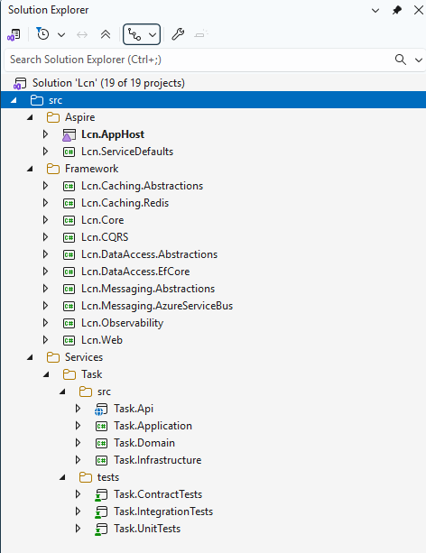

# **Task Management System — Solution Architecture Proposal**

## **Table of Contents**

1. [Goals](#1-goals)
2. [Solution Architecture](#2-solution-architecture)
   - 2.1 [Architecture Approach](#21-architecture-approach)
   - 2.2 [Key Components and Technology Decisions](#22-key-components-and-technology-decisions)
     - [Web UI](#web-ui)
     - [Public API](#public-api)
     - [Authentication & Authorization](#authentication--authorization)
     - [API Gateway](#api-gateway)
     - [Database](#database)
     - [Caching](#caching)
     - [Messaging / Eventing](#messaging--eventing)
     - [File Storage](#file-storage)
     - [Observability](#observability)
     - [Deployment](#deployment)
   - 2.3 [Backend Service Development](#23-backend-service-development)
     - [Architecture Style](#architecture-style)
     - [Internal NuGet Packages (Shared Building Blocks)](#internal-nuget-packages-shared-building-blocks)
     - [Important Note — Trend in .NET OSS Libraries Becoming Commercial](#important-note--trend-in-net-oss-libraries-becoming-commercial)
     - [API Design](#api-design)
     - [Testing Strategy](#testing-strategy)
     - [Solution Structure](#solution-structure)
   - 2.4 [Frontend Development](#24-frontend-development)
     - [Architecture Style](#architecture-style-1)
     - [State Management & Data Fetching](#state-management--data-fetching)
     - [API Integration & Security](#api-integration--security)
     - [UI/UX & Design System](#uiux--design-system)
     - [Shared Frontend Utilities](#shared-frontend-utilities)
     - [Frontend Testing Strategy](#frontend-testing-strategy)
   - 2.5 [CI/CD with Azure DevOps](#25-cicd-with-azure-devops)
     - [Development Workflow](#development-workflow)
     - [Continuous Integration (CI)](#continuous-integration-ci)
     - [Continuous Deployment (CD)](#continuous-deployment-cd)
     - [Environment Configuration](#environment-configuration)
     - [Environment Promotion](#environment-promotion)
   - 2.6 [DevOps Practices](#26-devops-practices)
   - 2.7 [Use of AI Tools](#27-use-of-ai-tools)

# 1. **Goals**

This document proposes a **cloud-ready, scalable, secure Task Management System** designed for both internal and external users.

Key goals:

- Create, upload attachments, assign, notify users and track tasks.
- Support authentication & authorization.
- Provide an API for integrations.
- Have a web UI for users.

Assumptions:

- The company primarily uses Azure Cloud.

---

# 2. **Solution Architecture**

## 2.1 Architecture Approach

The approach will start small and prevent premature complexity while enabling long-term evolution.

- Start with **monolith**, one deployable backend (simple ops, fast development) with docker container. Internally composed of features with clear boudaries.
- Can consider **modular monlith** from beginning where features can be extracted **modules**, depends on the size of that features.
- Later can be extracted to **microservices** with small effort.

## 2.2 Key components and technology decisions

### **Web UI**

- **React + TypeScript** SPA communicating via HTTPS + JWT.
- Benefits: large ecosystem, excellent tooling.
- **Alternatives**: Vue, Angular — choose based on team capability.

### **Public API**

- **ASP.NET Core Web API** (REST + OpenAPI).

  - Simple, predictable, widely supported by third parties.

- **Optional**: OData support for dynamic querying.

### **Authentication & Authorization**

- **Azure Entra ID** for:

  - Internal corporate users (Entra ID)
  - External users (Entra External ID / Customer Identity)
  - External Integrations (3rd-party systems calling our API): **OAuth2 client credentials** via Azure Entra ID. Each partner gets its own Entra app registration (client ID/secret or certificate). Partner calls Entra /token → gets access token (JWT) → calls our API via APIM with **Authorization: Bearer <token>**.

- **Access Control**:

  - JWT tokens with claims (role, userId, permissions).
  - Policy-based authorization for task-level rules.

- **OSS Alternative** (when cloud lock-in or pricing is an issue):

  - **Keycloak** (self-hosted OIDC provider)

### **Application Gateway / Front Door**

- **Azure Front Door** (recommended for global deployments):

  - Global load balancing and routing across regions.
  - Built-in WAF (Web Application Firewall) for protection against common threats (OWASP Top 10, bot attacks).
  - SSL/TLS termination and certificate management.
  - Caching static content (React bundles, images) at edge locations.

- **Azure Application Gateway** (for single-region scenarios):

  - Regional load balancing with URL-based routing.
  - Integrated WAF for security.
  - SSL offloading.

### **API Gateway**

- **Azure API Management (APIM)**:

  - JWT validation, rate limiting, quota for partners.
  - Request/response transformations.
  - IP allowlists for integrations.

- **OSS Alternative**:

  - **YARP (Yet Another Reverse Proxy)** in .NET for simple API gateway needs.
  - Useful when you want full control or no APIM licensing cost.

### **Database**

- Recommend starting with relational database:

  - **Option A: Azure SQL Database** (best for enterprise consistency, strong tooling).
  - **Option B: PostgreSQL (Flexible Server)** (cost-efficient, rich JSON querying, OSS ecosystem).

### **Caching**

- **Azure Cache for Redis** for:

  - Access tokens & session caching
  - User profile & permission caching

### **Messaging / Eventing**

- **Azure Service Bus** for:

  - TaskCreated, TaskAssigned, TaskOverdue events
  - Notification workers
  - Integration with external systems via topics/subscriptions

- **OSS Alternative**:

  - **RabbitMq**.

### **File Storage**

- **Azure Blob Storage** with:

  - Private containers
  - SAS URL generation for secure downloads

### **Observability**

- **OpenTelemetry** SDK for:

  - Traces
  - Logs
  - Metrics
  - Export to **Azure Application Insights**.

- **Azure Monitor** for platform metrics & logs from:

  - Azure App Service for Containers
  - Azure Front Door / App Gateway
  - Azure API Management
  - Azure SQL / PostgreSQL
  - Service Bus, Redis, Storage, etc.

- **Alternatives**:

  - **Prometheus + Grafana** (OSS observability stack)
  - **Loki / Tempo** (for logs/traces)
  - Useful if adopting Kubernetes and want cloud-agnostic observability.

### **Deployment**

- Containerized application:

  - Build using Azure DevOps
  - Push to **Azure Container Registry**
  - Deploy to **Azure App Service for Containers**

- Later (higher scale): **Container Apps** or **AKS**

## 2.3 Backend Service Development

### **Architecture Style**

- Follow **Clean Architecture**: separation of Domain, Application, Infrastructure, and API layers.
- Apply **DDD**: aggregates, entities, value objects, domain events.
- Organize code **by feature** (Tasks, Attachments, Notifications) for clarity and maintainability.
- Use **.NET Aspire** for local orchestration of API, DB, cache, and messaging during development.

### **Internal NuGet Packages (Shared Building Blocks)**

- **Core Domain Package**
  Base entity classes, domain events, value objects, error/result types.
- **Data Access Package**
  EF Core base `DbContext`, common repository patterns, soft-delete, auditing, and optional outbox support.
- **Messaging Package**
  Abstractions + wrappers for Azure Service Bus or RabbitMQ (publish/subscribe, message envelopes).
- **Web/Observability Package**
  Standard API behaviors: exception middleware, validation responses, correlation IDs, telemetry setup.

These packages ensure reusability if modules are extracted into standalone services later.

### **Important Note — Trend in .NET OSS Libraries Becoming Commercial**

In recent years, several widely used .NET OSS libraries have shifted to **commercial / restricted licensing** (e.g., **MediatR**, **MassTransit**, **AutoMapper**, **Hangfire**, etc). This trend impacts long-term architecture decisions.

- Prefer **in-house abstractions** (simple request/handler patterns, messaging wrappers).
- Avoid deep coupling to frameworks that may introduce licensing cost later.
- Keep **shared building blocks** (domain, data access, messaging) inside our internal NuGet packages to reduce external dependency risk.
- Favor **built-in .NET capabilities** (+ Aspire, + OTel) wherever possible.

This approach keeps the backend **future-proof, maintainable, and cost-predictable**.

### **API Design**

OpenAPI (Swagger) specification for your Tasks CRUD API, including OData support for listing: [task.openapi.yaml](openapi-spec/task.openapi.yaml)

- The spec file can be used to align and agreement between teams's integration, for example: front-end and back-end teams.
- It can be integrated to CI/CD pipelines to populate endpoints for API gateway.

### **Testing Strategy**

- **Unit Testing**: Focus on **Domain** and **Application** layers (business rules, validation, domain events).
  - **Tools**: **xUnit, Moq, FluentAssertions**.
- **Integration Testing**: Validates real interactions with infrastructure components:
  - EF Core + SQL/Postgres (via Testcontainers)
  - API endpoints using ASP.NET Core `WebApplicationFactory`
  * **Tools:**
    - **Testcontainers for .NET**
    - **ASP.NET Core Test Host**
- **Contract/API Testing**:
  - Ensures implementation matches **OpenAPI** specification.
  - Guards against breaking changes for frontend or integrations.
  * **Tools:**
    - OpenAPI validator
    - Pact
- **Performance & Load Testing**: Ensures scalability under high load.
  - **Tools:**
    - **k6**

All tests are integrated into CI/CD pipelines.

### **Solution Structure**

## **2.4 Frontend Development**

### **Architecture Style**

- Use **monorepo** structure with Turbo or Nx.
- Use **feature-based structure** (Tasks, Auth, Notifications, Settings) instead of purely technical folders.
- Follow **separation of concerns**:

  - Presentational components (UI only)
  - Container/hooks (data fetching, state, side effects)
  - Shared UI components (buttons, layout, form controls)

- Use **React Router** for client-side routing (e.g. `/tasks`, `/tasks/:id`).
- Communication with backend via a typed **API client layer** (fetch/axios wrapper).

### **State Management & Data Fetching**

- Prefer **TanStack Query** (or similar) for:

  - Server state (tasks list, task detail, user profile)
  - Caching, deduplication, background refresh
  - Built-in loading/error states and retries

- Use **React Context** only for cross-cutting UI state (theme, current user, layout).
- Keep **local UI state** inside components where possible (forms, dialogs).
- Need to consider carefully if want to use global state management like **Redux**. Most of the time, especially with enterprise application, we won't need it.

### **API Integration & Security**

- All API calls go through a **central API client**:

  - Base URL, default headers, error handling, logging.
  - Inject **JWT** from Azure Entra ID authentication (via MSAL or similar library).

- Handle:

  - Global 401/403 → redirect to login or show access denied.
  - Consistent error messages from backend error envelope.

### **UI/UX & Design System**

- Use a **component library** (e.g. MUI, Ant Design, or internal design system) for consistency.
- Responsive layout for desktop-first, tablet-friendly usage.
- Accessibility best practices (ARIA, keyboard navigation): examples with radix, shadcn.

### **Shared Frontend Utilities**

- **Types & Models**: shared TypeScript types, aligned with backend OpenAPI spec (generated where possible).
- **Validation**: form schemas using `Zod` for Typescript first.
- **Logging & Telemetry**: integrate with Application Insights JS SDK for page views, custom events, and errors.

### **Frontend Testing Strategy**

- **Unit & Component Testing**

  - Covers React components, hooks, and utilities.
  - Ensures UI renders correctly and handles user interactions.
  - **Tools:**
    - **Jest**
    - **React Testing Library**

- **Integration / UI Testing**

  - Component interaction tests (form submission, validation, navigation).

  * **Tools:**
    - **React Testing Library**

- **End-to-End Testing (Browser Automation)**

  - Full user journeys:

  * **Tools:**
    - **Playwright**

- All tests run in **CI** and are part of the **quality gates**.

## **2.5 CI/CD with Azure DevOps**

### **Development Workflow**

- Use **trunk-based development**:

  - Developers create short-lived feature branches.
  - All changes merge into `main` through **Pull Requests (PRs)**.

- PRs require:

  - Code review
  - Successful build & tests
  - SonarQube quality gate passed
  - No critical or high vulnerabilities

This ensures continuous integration with high-quality code.

### **Continuous Integration (CI)**

Triggered on every PR and commit to `main`.  
The same CI pipeline runs **backend** and **frontend** stages, then produces deployable artifacts (container images and static bundles).

#### **Backend CI + Container Build**

- Restore & build .NET backend
- Run:
  - Unit tests
  - Integration tests (Testcontainers)
  - API contract validation (OpenAPI)
- Static code quality:
  - **SonarQube** analysis
  - Dependency vulnerability scan
- Generate build artifacts:
  - Compiled binaries
  - OpenAPI spec
  - Test results
- Build and publish Docker images:
  - Build Docker images for:
    - API
  - Tag images with branch name, commit SHA, and version
  - Push images to **Azure Container Registry (ACR)**

#### **Frontend CI (React) + Bundle Build**

- Install dependencies (npm/yarn)
- Run:
  - Unit tests (Jest)
  - Linting (ESLint)
  - Type checking (TS)
  - SonarQube for JavaScript/TypeScript
- Build optimized production bundle
- Store build output as artifact, ready for deployment to:
  - **Azure App Service (Linux)**, or
  - **Azure Static Web App**

### **Continuous Deployment (CD)**

Promoted through **Dev → QA → UAT → Staging → Production** using approvals.

#### Backend Deployment

- Deploy container from ACR to **Azure App Service for Containers**
- Inject app settings and secrets via **Azure Key Vault**
- Use **slot swap** in staging → production for zero-downtime releases

#### Frontend Deployment

- Upload build artifact to:

  - **Azure App Service (static site)**
  - or **Azure Static Web Apps**

- Cache-busting enabled using versioned bundles
- Optional: CDN integration for global performance

### **Environment Configuration**

- Secrets stored in **Azure Key Vault**
- Per-environment variables in Azure App Service Configuration

### **Environment Promotion**

- **Dev → QA**

  - Requires CI passing (tests, SonarQube, security scan).
  - Dev tests the features work as expected in Dev environemnt
  - Auto-approval; no manual reviewer needed.
  - If there are too many PRs in a day, auto-approval can make QA environment unstable for testing. Can change to manual approval by **QA Lead**

- **QA → UAT**
  Requires successful QA deployment and regression tests. Sign-off by **QA Lead**. Approved by **Product Owner**

- **UAT → Staging**
  Requires UAT sign-off and no high-severity defects. Approved by **Product Owner**.

- **Staging → Production**
  Requires successful smoke tests, performance checks, and security scan. Approved by **Release Manager**

## **2.6 DevOps Practices**

Ensuring fast, reliable delivery through automation, consistency, and observability.

- **Infrastructure as Code (IaC)**

  - Environments provisioned and updated using Bicep or Terraform.
  - Source-controlled, versioned, and validated through CI.

* **Automated CI/CD (Azure DevOps Pipelines)**

  - CI handles build, tests, linting, quality checks, and container packaging.
  - CD manages environment promotions (Dev → QA → UAT → Staging → Prod), slot swaps, and smoke tests.

* **Configuration & Secrets Management**

  - Centralized via **Azure Key Vault**.
  - Environment-specific settings provided through App Service configuration or Static Web App configuration.
  - No secrets stored in code or pipelines.

* **Observability & Monitoring**

  - Application Insights + OpenTelemetry for logs, metrics, traces, and dashboards.
  - Alerts for failures, latency, error rates, queue backlogs, and resource thresholds.

## **2.7 Use of AI Tools**

AI-assisted development is used to accelerate productivity, reduce repetitive work, and enhance code quality.

**Recommended AI Tools:**

- **GitHub Copilot / Copilot Chat**

  - Generating boilerplate code (DTOs, controllers, React components).
  - Generating UI components by connecting with Figma MCP.
  - Assisting with unit tests and integration test scaffolding
  - Helping developers explore frameworks and design patterns faster
  - Refactoring proposals (cleaning up legacy or verbose code)
  - Writing documentation, comments, commit messages
  - Generating test cases from requirements
  - Creating automatic E2E test scripts (Playwright/Cypress)
  - Enhancing regression test coverage through scenario exploration
  - Writing YAML pipelines (Azure DevOps)
  - Generating IaC templates (Bicep/Terraform)

- **ChatGPT / Azure OpenAI**

  - Producing architecture drafts, ADRs (Architecture Decision Records)
  - Acting as an interactive design assistant to brainstorm with

**Measuring the Impact of AI Tools:**

- **Developer Productivity & Satisfaction**

  - Time saved on boilerplate, refactoring, documentation
  - Survey feedback on AI-assisted workflows
  - Reduction in context-switching and manual repetitive tasks
  - Faster troubleshooting using AI-assisted log and error analysis
